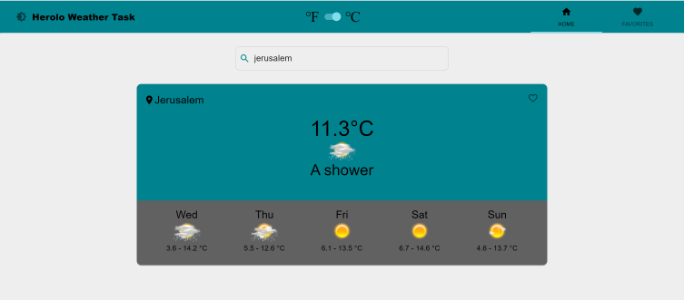
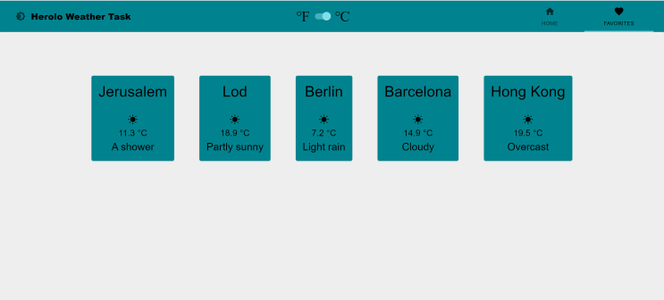

# Weather-App

## Table Of Contents
  - [Introduction](#introduction)
  - [Technologies](#technologies)
  - [Installation](#installation)
  - [Screenshots](#screenshots)

## Introduction

Weather Application to view the weather of specific locations. 

## Technologies

* [Create React App](https://github.com/facebook/create-react-app) v17.0.1
* [Material - UI](https://github.com/mui-org/material-ui) v4.11.0
* [Material - UI Icons](https://github.com/mui-org/material-ui) v4.9.1
* [Redux](https://github.com/reduxjs/redux) v4.0.5
* [React-Redux](https://github.com/reduxjs/react-redux) v7.2.2
* [Redux-Persist](https://github.com/rt2zz/redux-persist) v6.0.0
* [Axios](https://github.com/axios/axios) v0.21.0
* [React-Router-Dom](https://github.com/ReactTraining/react-router) v5.2.0

## Installation

Use the package manager [npm](https://www.npmjs.com/) to install Weather-App.

```npm
git clone "https://github.com/yuvalitah/Yuval-Itah-22-11-2020.git"
cd ../path/to/the/file
npm install
```
To start the project
```npm
npm start
```

## Screenshots

### Home Page


### Favorites Page

